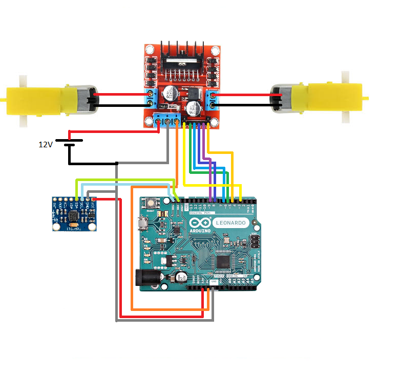
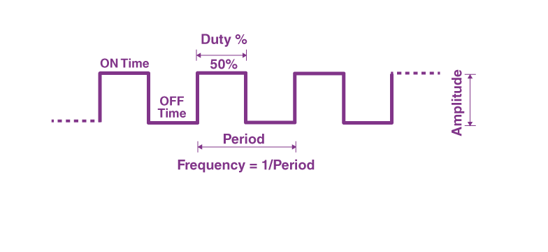

# DC Motors PWM using Accelerometer

### Objective
The purpose of this super easy and basic mini project is to just get basic understanding of how you can work with dc motors with arduino to make really cool projects later.
### Circuit

### Parts
- Arduino Leonardo (You can use any. Just reference your SDA SCL and PWM pins from its datasheet)
- H-Bridge Driver : L298N
- MPU 6050
- 12 V Battery 

### Overview
Let's take a brief overview of how everything works:
- ##### Pulse Width Modulation
    A pulse width modulated output signal is one that has a period and an output “on time”, or duty cycle, within that period.
    

    The Duty Cycle denotes the percentage of time when the signal is on in 1 period. This effectively controls or "modulates" the speed of our motors.

    In <b>Arduino</b>, PWM is controlled by specified pins marked as ~ on the board. You can use PWM through analogWrite(PIN, DutyCycle). The Duty Cycle ranges from <b>0 to 255 </b> since its an 8 bit register.

    For example, if you want 50 % Duty Cycle you can write analogWrite(PIN, 127) or for 20% Duty Cycle it would be analogWrite(PIN, 51)

- ##### MPU 6050
    This is a very common sensor that has accelerometer and gyrometer builtin. One specific model we are using is called GY 521 which has an added temperature sensor builtin as well. We are only working with accelerometer.
    To work with this sensor in Arduino IDE you need to download MPU6050 Library from :
 

    https://www.arduino.cc/reference/en/libraries/mpu6050/
 

    Or you could open Library Manager and download it from there.
    We only need to give it Vcc and Ground and use SCL and SDA pins (Explained Later.)

- ##### L298N H Bridge
    Any arduino you will have, wont be able to provide that much voltage and current for dc motors (let alone 2 of them) to work properly. You need a driver circuit that can do that job for you. L298N is great one and easy to find. How it does what it does is too complex for now, bunch of capacitors and transistors, maybe a study for later. Here's what it looks like:

    

    The left and right blue dual slot headers are for your motors.
    The blue three slot one is where you give power to this H Bridge. 12V from the battery pack, 5V from arduino.
    <b>The ground must be common from battery back and your arduino</b>
    ENA and ENB are speed controls for motor 1 and motor 2. 
    You will most probably see a jumper jacket on top of these, these are just shorting the pins to run at max speed. Don't forget to take them off so that your PWM works properly!
    IN1,IN2 and IN3,IN4 control the direction of your motor spin.

- ##### I2C Communication Protocol
    An I2C is a way of sending and recieving information using a clock and a signal line. It uses two wire SCL (Serial Clock) and SDA (Serial Data). Yes, its the same one from the MPU 6050 section.
    For more in depth information, I found this very cool page that explains master and slave in communication protocols :
    https://www.circuitbasics.com/basics-of-the-i2c-communication-protocol/

### Results

